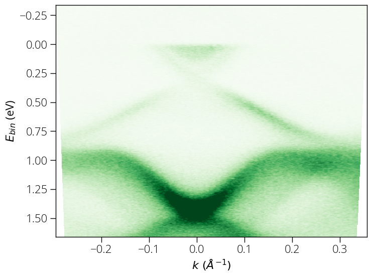
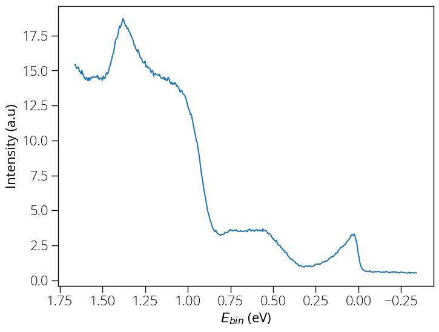
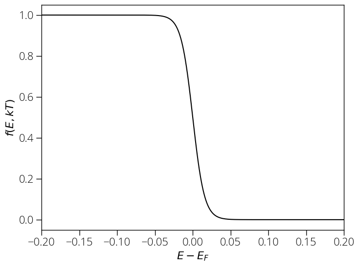
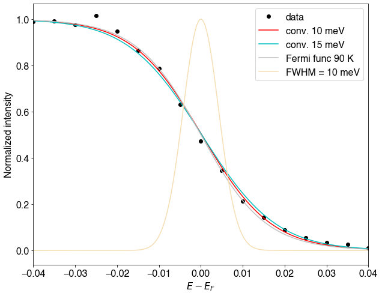

### Experimental ARPES resolution

The ARPES experimental resolution depends on several factors including
measurement temperature, sample quality, quality of electrical contact between
sample and analyzer, light source used, and the analyzer resolution. Here we
will describe a practical scenario. The sample for this measurement was grown
using molecular beam epitaxy (MBE) method. The sample was of very good quality.
We obtained the following ARPES spectrum using 10&nbsp;eV pass energy and
5&nbsp;meV energy step.

{:style="width:500px"}

We extract the Energy Distribution Curve (EDC) by integrating
±0.25&nbsp;Å-1 range.

{:style="width:500px"}

Thermal broadening is given by Fermi Dirac distribution:

$$ F(\epsilon) = \frac{1}{e^{(\epsilon - \mu)/k_B T} + 1} $$

Above measurement was carried out at liquid nitrogen temperature; the sample
temperature reaches about 90&nbsp;K, at which the Fermi-Dirac distribution looks
like this:

{:style="width:500px"}

Now, we can convolute a Gaussian broadening of 10&nbsp;meV, which fits our
experimental data well.

{:style="width:500px"}

There is some room for adjusting the fitting parameters, but the slope is
certainly better than 15&nbsp;meV for our current data. Therefore, we have about
8&nbsp;meV thermal broadening at 90&nbsp;K and 10&nbsp;meV instrumental
(combines analyzer resolution, light source broadening etc.), i.e., we can
expect better than 15&nbsp;meV
$(\sigma_{total} \le \sqrt{\sigma_x^2 + \sigma_y^2})$ resolution.
