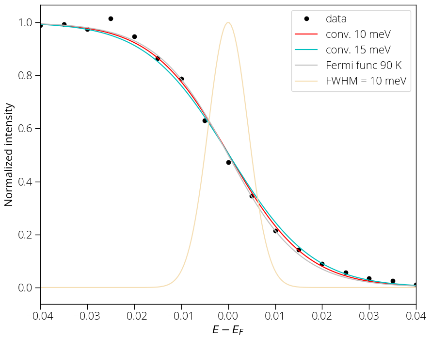

### Experimental ARPES resolution 

The ARPES experimental resolution depends on several factors including measurement temperature, sample quality, quality of electrical contact between sample and analyzer, light source used, and the analyzer resolution. Here we will describe a practical scenario. The sample for this measurement was grown using molecular beam epitaxy (MBE) method. The sample was of very good quality. We obtained the following ARPES spectrum using $10~eV$ pass energy and $5~meV$ energy step. 

{:style="width:500px"} 

We extract the Energy Distribution Curve (EDC) by integrating $\pm0.25~Å^{-1}$ range. 

{:style="width:500px"} 

Thermal broadening is given by Fermi Dirac distribution: 

$$ F(\epsilon) = \frac{1}{e^{(\epsilon - \mu)/k_B T} + 1} $$

Above measurement was carried out at liquid nitrogen temperature; the sample temperature reaches about $90~K$, at which the Fermi-Dirac distribution looks like this: 

{:style="width:500px"} 

Now, we can convolute a Gaussian broadening of $10~meV$, which fits our experimental data well. 

{:style="width:500px"} 

There is some room for adjusting the fitting parameters, but the slope is certainly better than $15~meV$ for our current data. Therefore, we have about $8~meV$ thermal broadening at $90~K$ and $10~meV$ instrumental (combines analyzer resolution, light source broadening etc.), i.e., we can expect better than $15~meV$ $(\sigma_{total} \le \sqrt{\sigma_x^2 + \sigma_y^2})$ resolution. 
