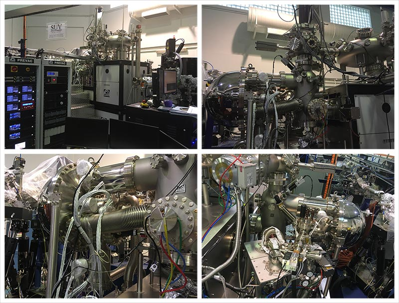

### About ARPES system 

- The ARPES system comprised of Scienta-Omicron DA30L hemispherical electron analyzer. 
- Base pressure of the system is $\sim 1 \times 10^{-10}$ mbar. 
- A Scienta VUV-5k helium discharge lamp with monochromator is used as photon source. 
- Mott spin detectors are also available for spin-resolved band measurement. 
- The manipulator can be cooled down using either liquid nitrogen (sample temperature ~90 K) or liquid helium cryogen. 
- Single crystalline sample can be exfoliated or cleaved in the load-lock chamber (pressure ~ $5 \times 10^{-8}$ mbar). 
- Thin film samples can be grown in-situ using PLD. 
- Certain samples can be prepared by argon sputtering and annealing. 

 

